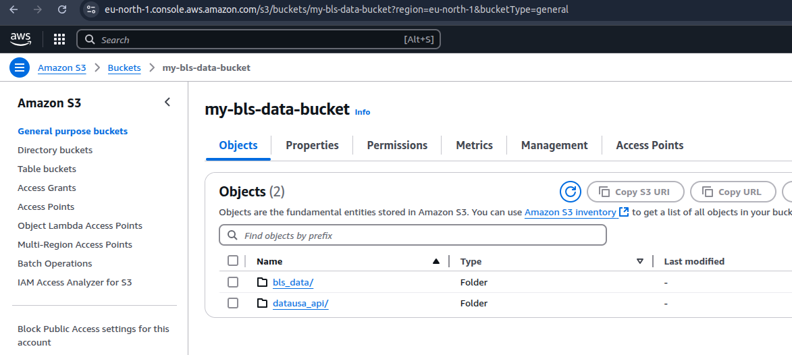
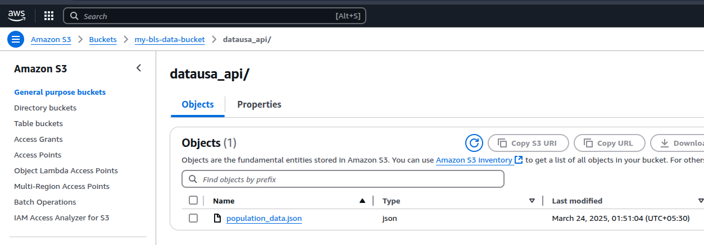
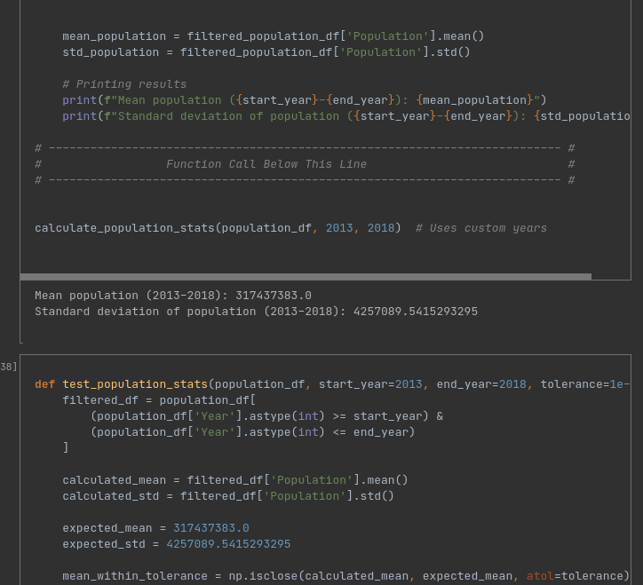
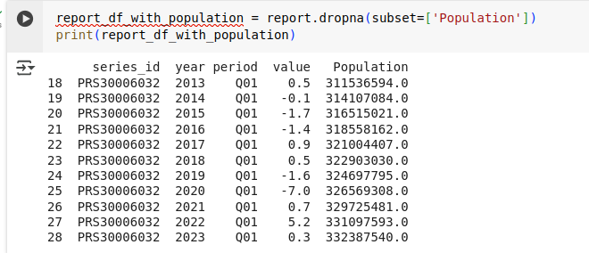

# AWS Data Pipeline

### Part 1: AWS S3 & Sourcing Datasets
Run below python file to download timeseries data and upload it to s3 bucket.
```shell
python bls_data_upload_to_s3.py
```
> 

### Part 2: APIs

Run below script to download population data from API and upload it to s3.
The data will be uplodaded to this [path](https://my-bls-data-bucket.s3.eu-north-1.amazonaws.com/datausa_api/population_data.json)
```shell
python api_data_to_s3.py
```
> 

### Part 3: Data Analytics
I have created ipynb that calculates following metrics
1. Generate the mean and the standard deviation of the annual US population across the years [2013, 2018] inclusive.
2. Finds the best year for every series_id. 
3. Get value for series_id = PRS30006032 for period = Q01 and the population for that given year. Here I am assuming that if population does not exist then show NaN
>

Here you can see that population is Nan for records where there is no data in population data set.
>

This can be filtered out to show only records where there is population 
```python
 report_df_with_population = report.dropna(subset=['Population'])
 print(report_df_with_population)
```



### Part 4: Infrastructure as Code & Data Pipeline with AWS CDK
- Lambda function is here: `lambda_function.py`
- SQS Processor: `sqs_processor.py`


In order to create the aws resources using terraform, run following commands
1. Make sure you have Terraform and AWS cli installed in your machine\


2. Initialize the Terraform

```shell
cd terraform-data-pipeline
terraform init
```

3. Make package of lambda and sql functions. 

```shell
# install dependency for lambda function
mkdir lambda_package
pip install requests boto3 beautifulsoup4 -t lambda_package/

# copy lambda function inside package to be zipped
cp lambda_function.py lambda_package/

# Zip the contents into a package
cd lambda_package
zip -r ../lambda_function.zip .
cd ..

# Zip the SQS processor
zip sqs_processor.zip sqs_processor.py

```

4. Validate the terraform steps. 

```shell
terraform validate
```

5. Finally apply the terraform to create resources in the cloud
You may run into issues due to privilege here, so you can give the user appropriate access to pass this step. 
```shell
terraform apply
```

Snapshot of creating resources:

> 

> 

> 

> 

> 

> 

> 