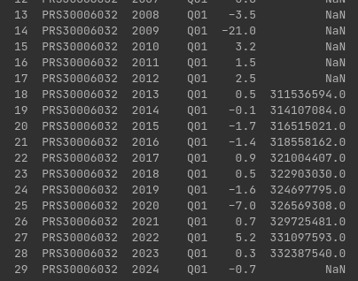

# AWS Data Pipeline

### Part 1: AWS S3 & Sourcing Datasets
Run below python file to download timeseries data and upload it to s3 bucket.
```shell
python bls_data_upload_to_s3.py
```
> 

### Part 2: APIs

Run below script to download population data from API and upload it to s3.
The data will be uplodaded to this [path](https://my-bls-data-bucket.s3.eu-north-1.amazonaws.com/datausa_api/population_data.json)
```shell
python api_data_to_s3.py
```
> 

### Part 3: Data Analytics
I have created ipynb that calculates following metrics
1. Generate the mean and the standard deviation of the annual US population across the years [2013, 2018] inclusive.
2. Finds the best year for every series_id. 
3. Get value for series_id = PRS30006032 for period = Q01 and the population for that given year. Here I am assuming that if population does not exist then show NaN
>

Here you can see that population is Nan for records where there is no data in population data set.
>

This can be filtered out to show only records where there is population 
```python
 report_df_with_population = report.dropna(subset=['Population'])
 print(report_df_with_population)
```


### Part 4: Infrastructure as Code & Data Pipeline with AWS CDK
- Lambda function is here: `lambda_function.py`
- 


This part is still in progress. 
Will add the instructions and information here once I complete this section. 


--

Till then you can have a look at my practical blog where I setup spark and airflow in docker container. 
I can automate above pipeline using airflow too. 